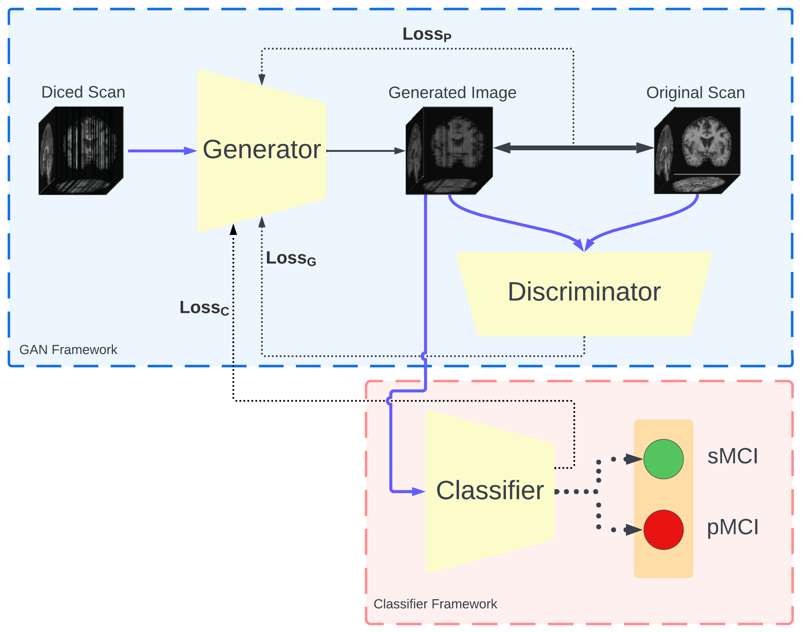

# Competitive deep learning for enhancing image reconstruction and classification of individuals with stable and progressive mild cognitive impairment

This work is currently ongoing.

# Introduction

This is the repo for the model proposed in the paper. Briefly, the model performs medical image (scans) reconstruction. The result shows that the reconstructed scans not only have better image quality, but also improves the prediction accuracy of MRI progression (sMRI vs pMRI).

The model is trained on a dataset from ADNI and evaluated on an exteranl dataset from NACC.

MRI progression prediction performance:

  

Image quality metrics:

See the paper for additional information

## Quick start

1. CUBLAS_WORKSPACE_CONFIG=:4096:8 python rcgan_main.py   (Train and generate scans for single G)
2. CUBLAS_WORKSPACE_CONFIG=:4096:8 python rcgans_main.py  (Train and generate scans for multiple G)
3. CUBLAS_WORKSPACE_CONFIG=:4096:8 python classifier_main.py    (Evaluate prediction performance using CNN)
4. (optional, in plot/) python plot.py
5. (optional, image quality) python image_quality.py

## Environments

1. Install python3
2. Install the environments.yml (Anaconda environment)
3. (optional, image quality) Install matlab for python (if standard method not work, try: sudo python setup.py install --prefix="/home/xzhou/anaconda3/envs/py36/")

## Data Preprocessing

The data preprocessing follows a similar procedure as in this work: ()

## Hyper-parameter Tuning

The json files that contains 'config' name (i.e. config.json) are the files that can be used to modify most of the hyperparameters.
